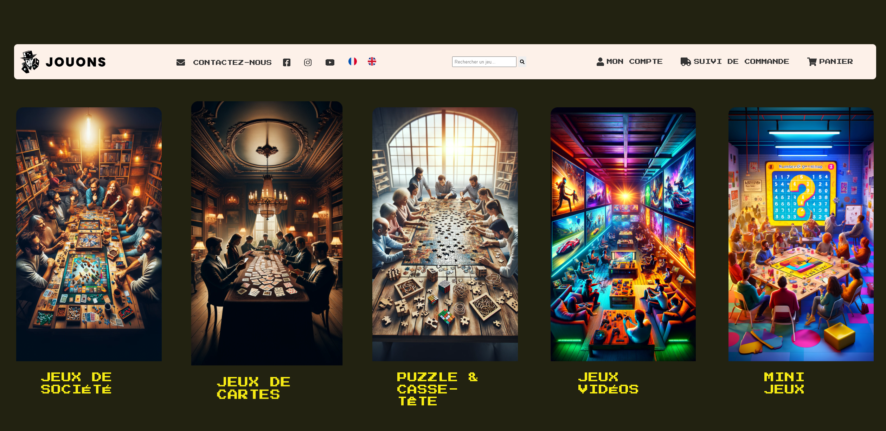

# 🕹️ Jouons - Site Web de Jeux

 <!-- Tu peux garder ce nom car tu l’as uploadé -->

## 📝 Description

**Jouons** est un site web e-commerce fictif dédié à la vente et à la découverte de jeux en tout genre :

🎲 Jeux de société  
🃏 Jeux de cartes  
🧩 Puzzles & casse-têtes  
🎮 Jeux vidéos  
🧠 Mini-jeux interactifs

Le site propose une interface moderne, stylisée et rétro, avec navigation claire, section multilingue, et un mini-jeu intégré codé en PHP.

---

## 🚀 Fonctionnalités

- 🌍 **Page d'accueil interactive** avec catégories de jeux
- 🎮 **Mini-jeu de devinette** en PHP
- 📱 Design responsive & stylé pixel-art rétro
- 🧭 Barre de navigation avec liens sociaux & langue
- 🛒 Boutons de compte, panier, suivi commande
- 🔍 Barre de recherche intégrée
- 📷 Illustrations visuelles attractives pour chaque type de jeu

---

## 🛠️ Technologies utilisées

- [HTML5](https://developer.mozilla.org/fr/docs/Web/Guide/HTML/HTML5)
- [CSS3](https://developer.mozilla.org/fr/docs/Web/CSS)
- [PHP](https://www.php.net/) 
- [Google Fonts – Press Start 2P](https://fonts.google.com/specimen/Press+Start+2P)
- [JS](https://developer.mozilla.org/fr/docs/Web/JavaScript) 

---


## ⚙️ Comment utiliser ce projet

```bash
# 1. Cloner le dépôt
git clone https://github.com/ton-user/nom-du-repo.git
cd nom-du-repo

# 2. Démarrer un serveur PHP local
php -S localhost:8000

# 3. Ouvrir dans ton navigateur
http://localhost:8000/homePage.html
